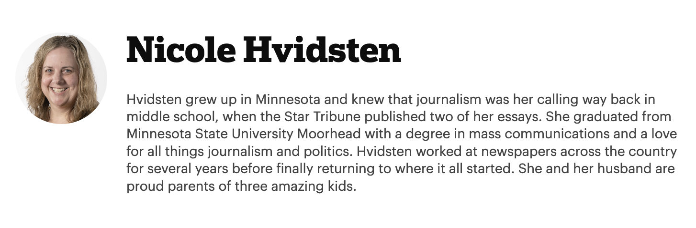

# The Minnesota Star Tribune Technical Assessment 
### Mid-Level Engineer - Frontend

### Table of Contents

- [Create Your Own Copy of this Repository](#create-your-own-copy)
- [Check Out the Correct Assessment Branch](#check-out-the-correct-assessment-branch)
- [Instructions](#instructions)
- [Submitting Your Work](#submitting-your-work)
- [Assessment Ticket](#assessment-ticket)
- [🛠 Development & Run Commands](./dev.md)

---

### Create Your Own Copy

Click the green "Use this template" button at the top of the repository page to create your own **public** copy under your GitHub account.

Once created, clone it to your local machine:

```bash
git clone git@github.com:your-username/your-repo-name.git
cd your-repo-name
```

### Check Out the Correct Assessment Branch
You’ll complete your work on a specific branch depending on your role and assessment type.

📬 Check your invitation email for the name of the branch you should use — for example, `mid-level-assessment/frontend`.

Fetch all branches and switch to the correct one:

```
git checkout mid-level-assessment/frontend  # Replace with the branch specified in your email
```

### Instructions
In the branch provided by the hiring manager, you’ll find a sample ticket similar to what you might receive at The Minnesota Star Tribune. You will find the full ticket [at the bottom of this README](#assessment-ticket).

Your task is to read through it, understand the intent, and implement a solution. This is your opportunity to show us how you approach a problem, organize your code, and communicate trade-offs or ideas. If you see opportunities to improve the existing code, feel free to go for it — or leave a comment noting what you'd change and why.

⏱️ **Time Expectations**  
Please aim to spend around **1 hour** or less on this. No more than **2 hours max** — we want to respect your time.

💬 **Stuck or Blocked?**  
It happens!

If you run into any snags — whether it’s the repo not setting up, you’re confused about the project structure, or something just isn’t clicking — please reach out to the hiring manager. Asking for help is a skill we value deeply here, and we see debugging and pair-programming as collaborative, not corrective.

If you need a hand, we’ll hop on a quick call and work through it together. This isn’t a test of perfection — it’s a chance to get a feel for how we solve problems together.

### Submitting Your Work
When you’re done:

- Push your changes to your GitHub repo.
- Create a Pull Request in your repo (draft is fine).
- Email the link to the pull request to the Hiring Manager.
- During the technical portion of your final interview, you’ll walk through your solution with a team member and discuss your approach, trade-offs, and ideas for future improvement(s).

--- 

### Assessment Ticket
✨ Feature: Author Profile Pages

**Problem Statement**
Right now, our app shows a list of articles, but there's no way to explore more about the authors behind the work. Readers can see a byline, but they can’t learn who the author is or what else they’ve written.

**Proposed Solution**
We recently introduced a dedicated dataset of authors (`apps/web/src/hardcoded-data/authors.tsx`). Let’s use this to power a brand new author profile page. Clicking an author’s name will take the user to `/author/author-name`, where they can learn more about that journalist.

**Business Value**
Author pages help personalize the reading experience and strengthen trust. They create a clearer sense of voice and expertise while also encouraging deeper engagement with related content. This improves reader retention and lays the groundwork for future features like "follow this author" or "trending journalists."

**Business Requirements**
 - All author names should be clickable.
 - Clicking on a name should navigate to `/author/author-name`.
    - The author page must include:
        - Author’s full name
        - Their bio
        - A headshot image

**Design Comps**


It’s expected that your implementation will not match the design exactly.

### ❓ Open Question
We’d **LOVE** to include previews of that author’s articles on their profile page. Is that something you think is feasible given how the data is currently set up?
It's alright if it’s out of scope — but if it’s a relatively straightforward addition, we’d love to see it explored!
